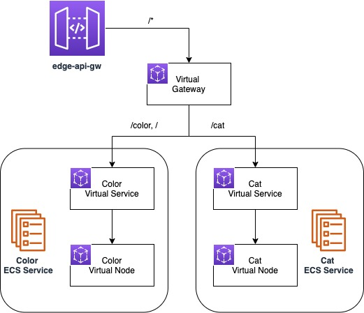

# Using API Gateway with ECS and App Mesh

Clone this repository and navigate to the walkthrough/howto-ecs-api-gateway folder, all commands will be run from this location.

## System Details
In this system, there is an internet facing API Gateway that terminates ingress traffic and forwards it to mesh gateway (virtual-gateway). This mesh gateway is configured to use path based matches to route ( / -> color ), ( /color -> color ) and ( /cat -> cat ). Color and Cat are two backend services within the mesh that are exposed as virtual-services provided by virtual-node.



## Setup

1. Your account id:
    ```
    export AWS_ACCOUNT_ID=<your_account_id>
    ```
1. Your region:
    ```
    export AWS_DEFAULT_REGION=<i.e. us-west-2>
    ```
    
1. The latest envoy image, see https://docs.aws.amazon.com/app-mesh/latest/userguide/envoy.html
   ```
   export ENVOY_IMAGE=<from_appmesh_user_guide_above>
   ```
    
1. Deploy the resources (this will take about 5-10 minutes to complete):
    ```
    ./deploy.sh
    ```
   
1. Once the script has executed there will be a public endpoint, save this for later.


## Teardown

Run the following to delete the stack
```
./deploy.sh delete
```
